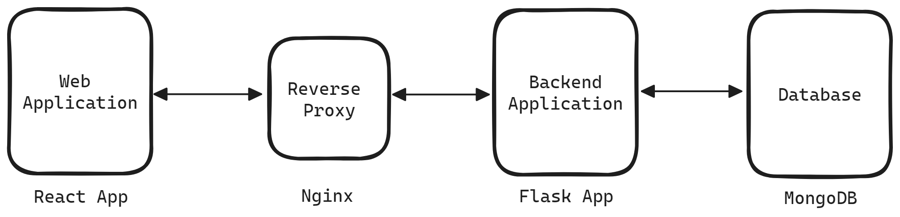

### Dockerize Multitier Applications

#### Project Description: 
- Containerize a `React` (frontend) application 
- Containerize a `Python` (backend) application 
- Establish connectivity between the two applications
- Set up `NGINX` as a reverse proxy (in between the frontend and backend server)
<br>
<p align="center">
  
  <em>Straight forward networking between the containers</em>
</p>
<br>

#### Run the Project (locally):
First, clone the repo locally and make sure the machine has docker installed and daemon is running.
To run the project use the command below using `docker-compose`. To start the containers in the background, use the -d option.
```shell
$ docker-compose up -d
```

#### Configure Github Actions Workflow:
Provide these following variables as Github Action's environment secrets:
  - `DOCKER_USERNAME`: Provide `Docker ID` of the Docker account
  - `DOCKER_PASSWORD`: Provide password of the Docker account
   
